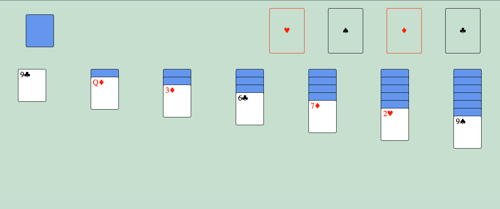

# simple-solitaire

This was a project I did in a weekend. It uses the browsers drag and drop api to move cards between columns. I used JSDoc to add type hints to the code.

## How To Play

- Click the deck to flip a card
- Click and drag a card to place one card on another
- Double click a card to move it to its completed column in the top right corner.

## ToDo

1. Make sure only the last card in a column can be flipped
2. Add themes
3. Add images for the backs of cards
4. Add a game win state 🎉
5. Add a shortcut to move all cards to completed columns when able
6. Make the bouncing card animation from windows 95 days
